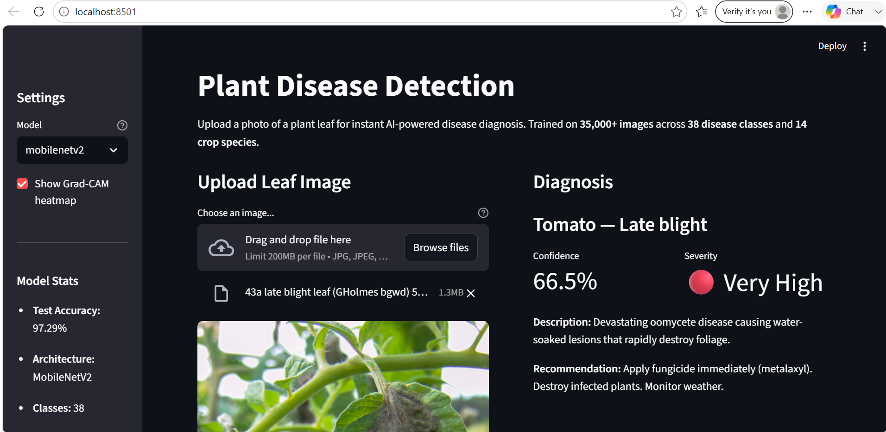
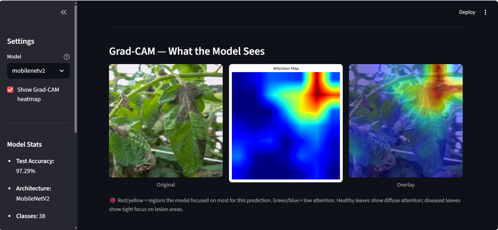

# Plant Disease Detection from Leaf Images

A deep learning system that classifies 38 plant disease categories across 14 crop species from leaf photographs. Built with PyTorch using transfer learning on MobileNetV2, trained on 35,000+ images from the PlantVillage dataset, and deployed as an interactive Streamlit web application with Grad-CAM visual explanations.

**Test Accuracy: 97.29% on held-out test set**

---

## Demo

Upload any leaf photo and the app returns:
- Predicted disease with confidence score
- Severity rating and treatment recommendation
- Grad-CAM heatmap showing which regions of the leaf drove the prediction
- Top 5 class probabilities





---

## Results

| Metric | Value |
|--------|-------|
| Test Accuracy | 97.29% |
| Macro F1 Score | 0.96 |
| Weighted F1 Score | 0.97 |
| Number of Classes | 38 |
| Test Set Size | 8,146 images |

Selected per-class results:

| Class | Precision | Recall | F1 |
|-------|-----------|--------|----|
| Blueberry healthy | 1.00 | 1.00 | 1.00 |
| Squash Powdery mildew | 1.00 | 1.00 | 1.00 |
| Orange Citrus greening | 0.99 | 1.00 | 1.00 |
| Corn Common rust | 1.00 | 0.98 | 0.99 |
| Apple Apple scab | 0.93 | 0.97 | 0.95 |
| Tomato Late blight | 0.96 | 0.92 | 0.94 |

---

## Dataset

**PlantVillage** — publicly available on Kaggle  
Link: https://www.kaggle.com/datasets/abdallahalidev/plantvillage-dataset

| Property | Value |
|----------|-------|
| Total images | 35,689 |
| Classes | 38 |
| Crop species | 14 |
| Input size | 224 x 224 (RGB) |
| Class imbalance ratio | 36x (handled via weighted sampler) |

Crops: Apple, Blueberry, Cherry, Corn, Grape, Orange, Peach, Pepper, Potato, Raspberry, Soybean, Squash, Strawberry, Tomato.

---

## Technical Approach

### Transfer Learning — Two-Phase Training

Rather than training a convolutional network from scratch, this project fine-tunes MobileNetV2 pretrained on ImageNet. The rationale is that early CNN layers already encode universal visual features — edges, textures, color gradients — that transfer well to leaf disease patterns.

**Phase 1 — Head training (epochs 1–10)**  
The entire backbone is frozen. Only the new classification head is trained using Adam with a learning rate of 1e-3. This rapidly adapts the output layer to the 38-class problem without disturbing the pretrained features.

**Phase 2 — Selective fine-tuning (epochs 11–20)**  
The last two backbone blocks are unfrozen. Training resumes with a differential learning rate: 1e-5 for the backbone and 1e-4 for the head. This refines the higher-level feature representations for plant-specific patterns while preserving the low-level ImageNet features in earlier layers.

This two-phase approach consistently outperforms training the full network end-to-end from the start, especially on datasets of this size.

### Handling Class Imbalance

The dataset has a 36x imbalance (Soybean healthy: 5,090 images vs Potato healthy: 152 images). A WeightedRandomSampler is used during training so that each class is sampled with equal probability per epoch, regardless of its actual size. Without this, the model would see majority classes far more often and develop biased decision boundaries.

### Data Augmentation

Applied during training only:
- Random resized crop (scale 0.8–1.0)
- Random horizontal and vertical flip
- Random rotation up to 15 degrees
- Color jitter (brightness, contrast, saturation, hue)
- ImageNet normalization

Validation and test sets use only resize, center crop, and normalization — no augmentation.

### Grad-CAM

Gradient-weighted Class Activation Mapping (Grad-CAM) visualizes which spatial regions of the input image most influenced the prediction. Gradients from the final convolutional layer are pooled and used to weight the activation maps, producing a heatmap overlaid on the original image. This makes the model's reasoning interpretable without modifying the architecture.

---

## Project Structure

```
plant-disease-detection/
├── data/
│   └── PlantVillage/           # 38 class folders (not tracked in git)
├── models/
│   ├── mobilenetv2_best.pth    # Trained model weights
│   └── class_mapping.json      # Index to class name mapping
├── outputs/
│   ├── 01_class_distribution.png
│   ├── 02_plant_summary.png
│   ├── 03_imbalance_analysis.png
│   ├── 04_sample_images.png
│   ├── 05_disease_distribution.png
│   ├── training_curves_mobilenetv2.png
│   ├── confusion_matrix_mobilenetv2.png
│   ├── gradcam_mobilenetv2.png
│   └── classification_report.txt
├── src/
│   ├── config.py               # Hyperparameters and paths
│   ├── dataset.py              # Data pipeline, augmentation, weighted sampler
│   ├── model.py                # MobileNetV2 and ResNet-50 definitions
│   ├── train.py                # Two-phase training loop
│   ├── evaluate.py             # Test evaluation, confusion matrix, Grad-CAM
│   └── eda.py                  # Exploratory data analysis
├── streamlit_app/
│   └── app.py                  # Inference web application
├── PlantDisease_Training.ipynb # Google Colab training notebook
├── requirements.txt
└── README.md
```

---

## Quickstart

### 1. Clone and install

```bash
git clone https://github.com/yourusername/plant-disease-detection.git
cd plant-disease-detection
pip install -r requirements.txt
```

### 2. Get the dataset

Download from Kaggle: https://www.kaggle.com/datasets/abdallahalidev/plantvillage-dataset  
Extract the `color/` subfolder and place it at `data/PlantVillage/` so that the 38 class folders sit directly inside it.

### 3. Run exploratory data analysis

```bash
python -m src.eda
```

Generates five plots in `outputs/` covering class distribution, healthy vs diseased breakdown, imbalance statistics, sample images, and disease proportions.

### 4. Train

Training is recommended on a GPU. The included Colab notebook (`PlantDisease_Training.ipynb`) handles the full pipeline on a free T4 GPU.

```bash
python -m src.train --model mobilenetv2 --epochs 20
```

Or open `PlantDisease_Training.ipynb` in Google Colab, enable the T4 GPU runtime, and run all cells. Training takes approximately 30–45 minutes.

### 5. Evaluate

```bash
python -m src.evaluate --model mobilenetv2
```

Outputs a classification report, normalized confusion matrix, and Grad-CAM visualizations to `outputs/`.

### 6. Run the web app

```bash
streamlit run streamlit_app/app.py
```

Opens at http://localhost:8501. Requires `models/mobilenetv2_best.pth` and `models/class_mapping.json` to be present.

---

## Tech Stack

| Component | Library |
|-----------|---------|
| Deep learning | PyTorch 2.0, torchvision |
| Model architecture | MobileNetV2 (pretrained on ImageNet) |
| Data splitting | scikit-learn |
| Visualization | matplotlib, seaborn, OpenCV |
| Web deployment | Streamlit |
| Training environment | Google Colab (T4 GPU) |

---

## Model Architecture

MobileNetV2 with a custom classification head:

```
MobileNetV2 backbone (pretrained on ImageNet)
    └── features[0..18]  — frozen in Phase 1, last 2 blocks unfrozen in Phase 2
Custom head:
    Dropout(0.3)
    Linear(1280 → 512)
    ReLU
    Dropout(0.2)
    Linear(512 → 38)
```

Total parameters: 2,899,238  
Trainable after Phase 2 unfreezing: 1,561,446 (53.9%)

---

## License

MIT
